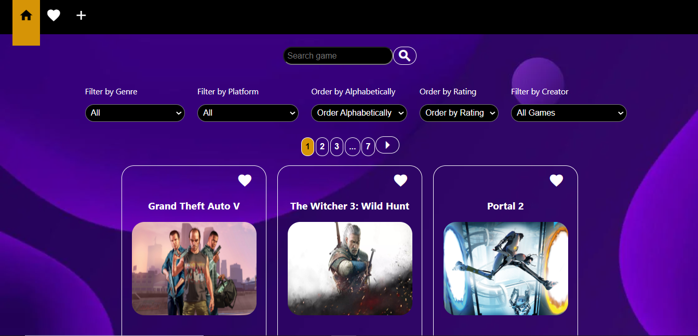
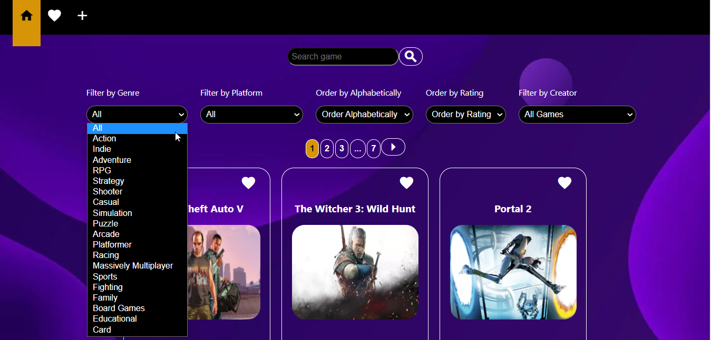
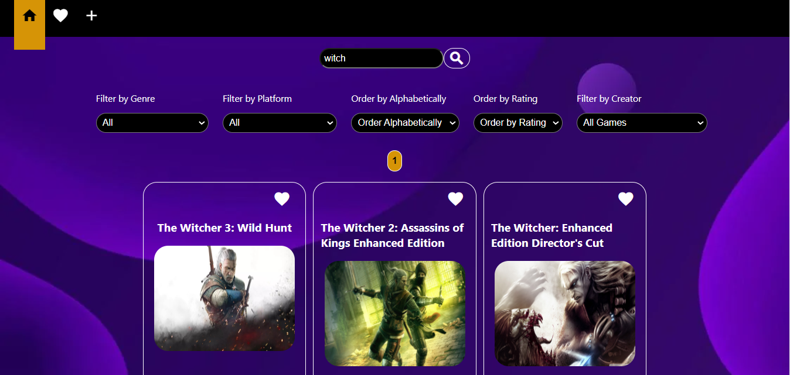
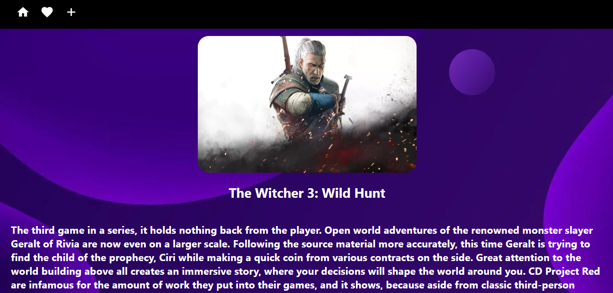
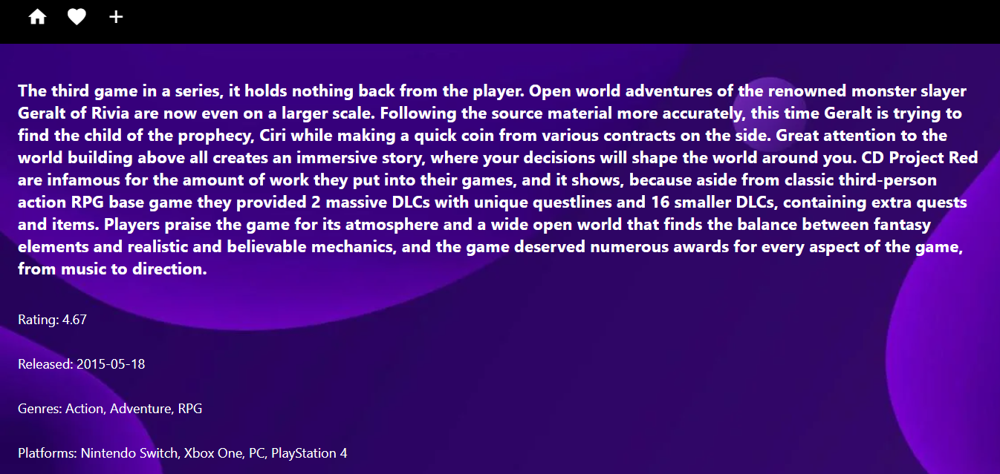
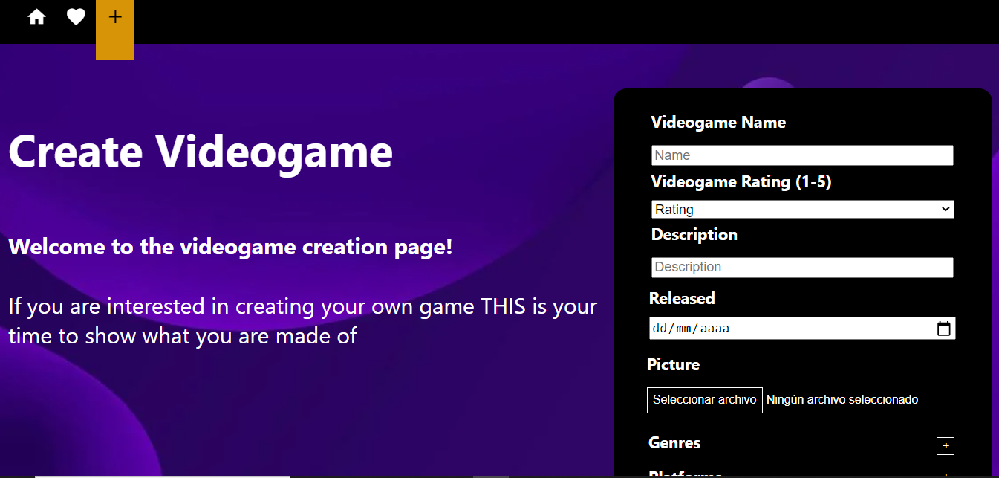
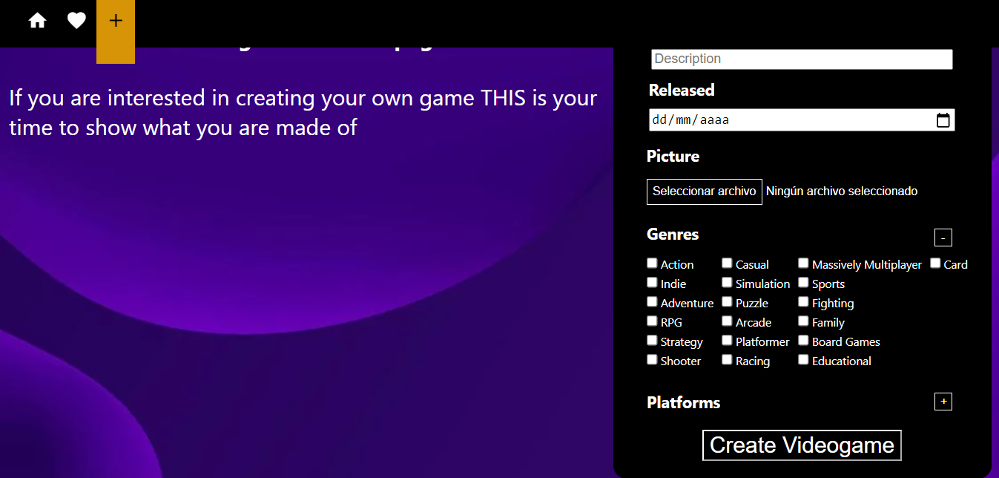
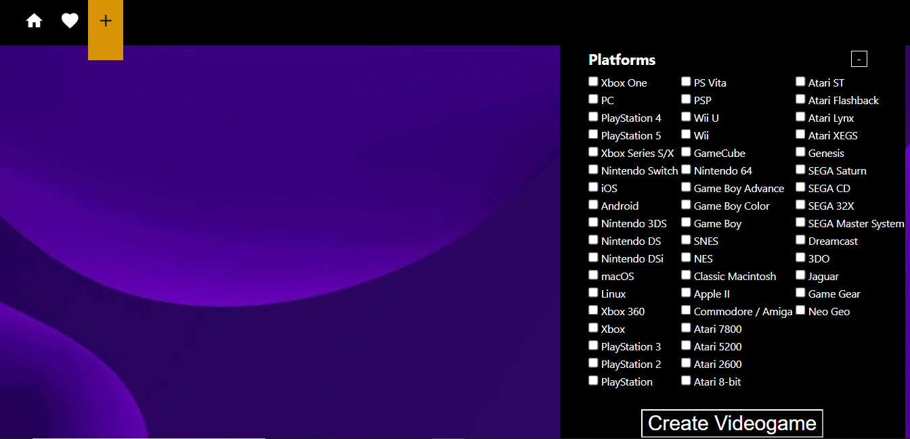

# Individual Project - Videogames-App

  

Realicé este proyecto en Abril 2021 con todas las tecnologías aprendidas en ese momento. Se puede navegar a través de los juegos, filtrar por género, ordenar por rating, buscar un juego en particlar y crear un juego nuevo.

#### Start API 🔧
`cd api`
`npm install`
`npm start`

#### Start Client🔧
`cd client`
`npm install`
`npm start`

#### Project built with
- [ ] React
- [ ] Redux
- [ ] Express
- [ ] Sequelize - PostgreSQL

